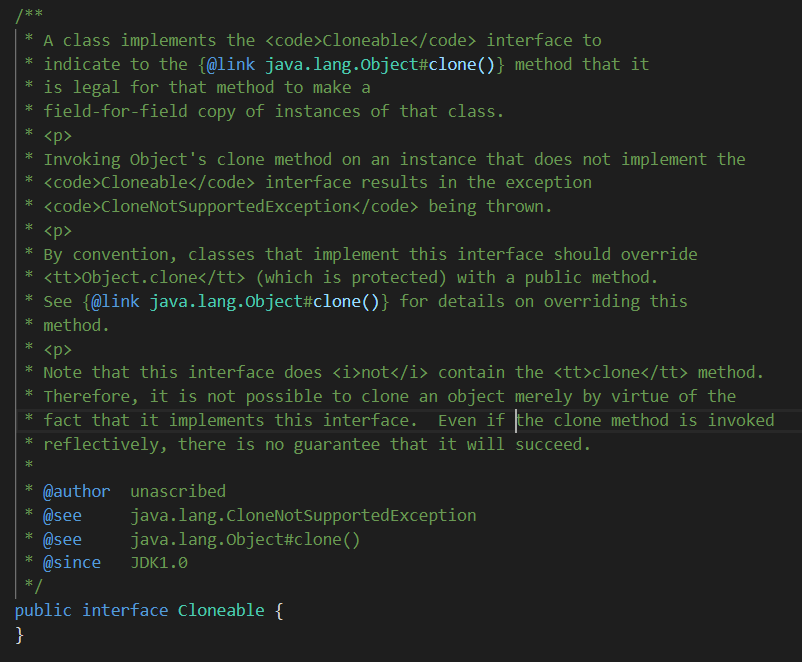

# 객체 복사

객체 지향 프로그래밍에서 객체를 복사하는 방법에 크게 두 가지가 있다.

- 얕은 복사(shallow copy) : 참조(메모리 주소)를 복사
- 깊은 복사(deep copy) : 참조하는 메모리 안의 값을 복사

> 참고 - [객체 복사 - 복사 방식](https://ko.wikipedia.org/wiki/%EA%B0%9D%EC%B2%B4_%EB%B3%B5%EC%82%AC#%EB%B3%B5%EC%82%AC_%EB%B0%A9%EC%8B%9D)

## 얕은 복사

얕은 복사를 할 경우 참조를 저장한 변수 명은 달라지지만, 같은 인스턴스를 공유한다.

```java
Object original = new Object();
Object shallowCopy = original;

original.equals(new Object()); // false
original.equals(shallowCopy); // true
```

얕은 복사는 같은 인스턴스를 공유한다. 따라서 복사한 변수를 이용하여 인스턴스의 필드를 바꾸게 되면 원본 객체의 필드도 변화한다.

```java
class UserInfo{
    private String name;
    
    // standard constructors, getters and setters
}
```

```java
void shallowCopyTest(){
    UserInfo someUser = new UserInfo("someName");
    UserInfo shallowCopy = someUser;
    
    shallowCopy.setName("changedName");
    
    someUser.getName(); // It returns "changedId"
    shallowCopy.getName(); // It return "changedId"
}
```

깊은 복사를 할 경우 이를 해결할 수 있다.

## 깊은 복사

깊은 복사를 할 경우 복사한 변수를 이용하여 인스턴스의 필드를 변경해도 원본 객체가 변하지 않는다.

```java
void deepCopyTest(){
    UserInfo someUser = new UserInfo("someName");
    UserInfo deepCopy = something for deep copy...;
    
    deepCopy.setName("changedName");
    
    someUser.getName(); // It returns "someId"
    deepCopy.getName(); // It returns "changedId"
}
```

Java에서 깊은 복사를 하는 방법에는 크게 세 가지가 있다.

- 새로운 객체를 생성하여 값을 직접 넣어준다.
- 복사 생성자나 팩토리 메서드를 사용한다.
- Cloneable Interface를 구현한다.

### 값을 직접 넣어주기

가장 간단한 방법이다.

```java
void deepCopyTest(){
    UserInfo someUser = new UserInfo("someId", "someName");
    UserInfo deepCopy = new UserInfo(someUser.getId(), someUser.getName());
    
    deepCopy.setId("changedId");
    deepCopy.setId("changedName");
    
    someUser.getId(); // It returns "someId"
    deepCopy.getId(); // It returns "changedId"
}
```

예제는 `UserInfo` 클래스의 필드가 두 개 밖에 없으므로 간단히 작성할 수 있지만, 만약 필드가 많아진다면 객체를 복사할 때 마다 많은 작업을 해야 할 것이다.

```java
UserInfo deepCopy = new UserInfo(someUser.getId(), someUser.getName(), someUser.getAddress(), someUser.getCellPhoneNumber, someUser.getSex(), someUser.getAlias(), someUser.get...);
```

생성자를 사용하지 않는다면 매번 필드 수 만큼의 불필요한 라인이 추가될 것이다.

```java
UserInfo deepCopy1 = new UserInfo();
deepCopy.setId(someUser.getId());
deepCopy.setName(someUser.getName())
deepCopy.setAddress(someUser.getAddress())
deepCopy.setCellPhoneNumber(someUser.getCellPhoneNumber)
deepCopy.setSex(someUser.getSex());
deepCopy.setAlias(someUser.getAlias());
deepCopy.set...;

UserInfo deepCopy2 = new UserInfo();
deepCopy.setId(someUser.getId());
deepCopy.setName(someUser.getName())
deepCopy.setAddress(someUser.getAddress())
deepCopy.setCellPhoneNumber(someUser.getCellPhoneNumber)
deepCopy.setSex(someUser.getSex());
deepCopy.setAlias(someUser.getAlias());
deepCopy.set...;
```

다른 방법들을 사용하면 이 문제를 해결할 수 있다.

### 복사 생성자(Copy Constructor)

복사 생성자는 말 그대로 객체를 복사하는 생성자를 만들어 주는 것이다.

```java
// UserInfo의 복사 생성자
public UserInfo(UserInfo userInfo){
    this.name = userInfo.getName();
    this.Address = new Address(userInfo.getAddress());
    /* 다음과 같이 구현할 수도 있다.
     * this(userInfo.getName(), userInfo.getAddress());
     */
}

// Address의 복사 생성자
public Address(Address address){
    this.name = address;
}
```

### 복사 팩토리(Static Factory Method, 정적 팩토리 메서드)

복사 팩토리는 복사 생성자의 변형이다.

> 팩토리 패턴과 다르다.

```java
public static UserInfo newInstanceCopiedByUserInfo(UserInfo userInfo){
    return new UserInfo(userInfo);
    /* 복사 생성자를 만들지 않았다면 다음과 같이 구현할 수도 있다.
     * this(userInfo.getName(), userInfo.getAddress());
     */
}
```

> 복사 팩토리는 이름을 가질 수 있기 때문에 복사 생성자를 쓴 것 보다 기능을 더욱 명확하게 나타낼 수 있는 장점이 있다. 복사 생성자는 기능이 명확하고 단순하기 때문에 복사 팩토리의 장점이 많이 드러나지 않지만, 일반적으로 생성자 대신 복사 팩토리를 사용하면 생기는 이점들이 있다. 이는 다음 글들을 참고하면 좋을 것 같다.
>
> - [Java Constructors vs Static Factory Methods](https://www.baeldung.com/java-constructors-vs-static-factory-methods)
> - [정적 팩토리 메서드(static factory method)](https://johngrib.github.io/wiki/static-factory-method-pattern/)

### Cloneable Interface

복사를 구현할 객체에 `Cloneable`을 구현하고, `Object.clone()`을 재정의 하여 사용한다. `Cloneable`을 구현하지 않고 `Object.clone()`만 재정의하여 사용할 경우 `CloneNotSupportedException`이 발생한다.

```java
class UserInfo implements Cloneable{
    private String id;
    private String name;
    
    // standard constructors, getters and setters
    
    @Override
    protected UserInfo clone() throws CloneNotSupportedException {
      return (UserInfo) super.clone();
  }
}
```

```java
void cloneableTest(){
    UserInfo someUser = new UserInfo("some id", "some name");
    UserInfo deepCopy = someUser.clone();
    
    deepCopy.setId("changed id");
    deepCopy.setId("changed name");
    
    someUser.getId(); // It returns "someId"
    deepCopy.getId(); // It returns "changedId"
}
```

>  참고 - [Interface Cloneable](https://docs.oracle.com/javase/8/docs/api/java/lang/Cloneable.html)

```java
class UserInfo implements Cloneable{
    private String name;
    private Address address;
    
    // standard constructors, getters and setters
    
    @Override
    protected UserInfo clone() throws CloneNotSupportedException {
      return (UserInfo) super.clone();
  }
}

class Address {
  private String name;

  // standard constructors, getters and setters
}
```

만약 위와 같이 클래스 필드가 값이 아닌 주소를 참조하는 객체일 경우 해당 객체는 깊은 복사가 되지 않는다.

```java
void cloneableTest(){
    UserInfo someUser = new UserInfo("some name", new Address("address name"));
    UserInfo deepCopy = someUser.clone();
    
    deepCopy.getAddress().setName("changed address Name");
    
    someUser.getAddress().getName(); // It returns "changed address Name"
    someUser.getAddress().getName(); // It returns "changed address Name"
}
```

이럴 경우 `Address`에 `clone()` 메소드를 구현한 뒤 , `UserInfo`의 `clone()` 메소드를 아래처럼 정의해야 한다.

```java
@Override
protected UserInfo clone() throws CloneNotSupportedException {
    UserInfo result = (UserInfo) super.clone();
    result.setAddress(result.getAddress().clone());

    return result;
}
```

> 참조로 인한 변경 가능성을 낮추기 위해 객체 필드를 final로 선언할 경우 위와 같은 방법은 사용할 수 없다.

### Cloneable은 지양하는 것이 바람직하다

#### 언어모순적이다

Java에서 새로운 객체를 생성하기 위해서 `new` 키워드와 생성자를 사용하기로 약속되어있다. 하지만 `clone()`을 사용하면 이러한 동작 없이 새로운 객체를 생성한다. 새로운 객체를 생성하는 규칙을 클라이언트에게 맡기는 것은 위험한 일이다.

#### clone의 규약은 허술하다

`clone()`의 일반 규약은 매우 허술하다. api문서에서 조차 클래스마다 'copy'의 의미가 달라질 수 있다고 말한다. 따라서 예시에서 사용했던 것과 같이 특정 클래스의 경우 `clone()`이 잘 동작하게 하기 위해 새롭게 재정의하여야 한다.

> 참고 - [Object.clone](https://docs.oracle.com/javase/8/docs/api/java/lang/Object.html#clone--)

#### 고려해야 할 사항이 많다

1. `Cloneable` 은 해당 클래스가 `Object.clone()`을 사용할 것이라고 명시적으로 선언해주는 역할을 하는 인터페이스다. `Cloneable` 인터페이스 내에 아무 것도 작성되어있지 않기 때문에 `Object`의 `clone()` 을 직접 재정의해야 한다. 이 때, `clone()`은 `Object` 타입을 리턴하기 때문에 리턴타입을 수정하고 `return` 문에서는 형변환을 해주어야 쓰기 편리하다.

2. 정상적인 설계라면 `Clonable` 안에 `clone()`을 정의하여 `Cloneable`을 구현할때 `clone()`을 구현하지 않을 경우 컴파일 오류를 발생 시키는 식으로 되어야 한다. 
   

   이러한 설계 오류로 인해 `clone()` `CloneNotSupportedException`을 추가했다. 따라서 `clone()` 을 편하게 쓰려면 이에 대한 처리를 해줘야 한다.

   ```java
   @Override
   protected UserInfo clone() throws CloneNotSupportedException {
       try {
         UserInfo result = (UserInfo) super.clone();
         result.setAddress(result.getAddress().clone());
   
         return result;
       } catch (CloneNotSupportedException e) {
         throw new AssertionError(); // 발생할 수 없는 일이다.
       }
   }
   ```

3. 또한 방어적 코딩을 위해 validation을 해주는 것이 필요할 수 있다.

   ```java
   if(someUser instanceof Cloneable){
       deepCopy = someUser.clone();
   }
   ```

복사 생성자 혹은 복사 팩토리와 `Cloneable`을 잘 비교한 글들이 있는데, 더 자세히 알고 싶다면 아래의 글을 읽어보길 권한다.

- [Copy Constructor versus Cloning - Josh Bloch on Design](https://www.artima.com/intv/bloch.html#part13)
- [Java Cloning - How Copy Constructors are Better Than Cloning](https://www.programmingmitra.com/2017/01/Java-cloning-copy-constructor-versus-Object-clone-or-cloning.html)

#### References

- [Effective Java 3/E](https://github.com/WegraLee/effective-java-3e-source-code)
